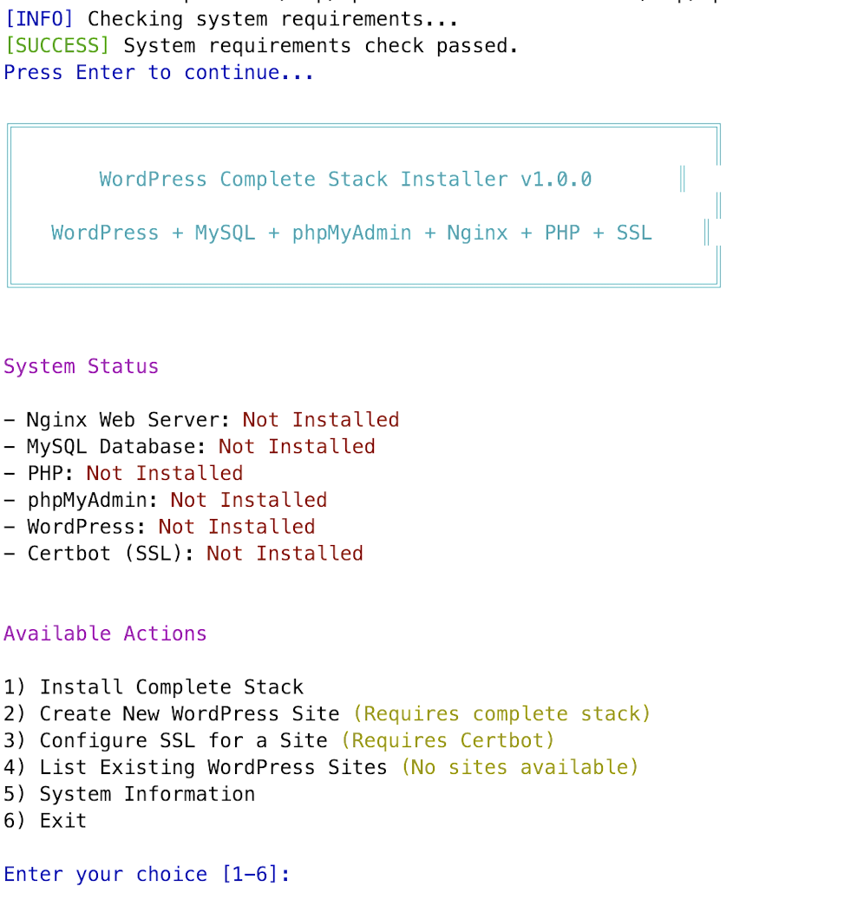

# WordPress Stack Installer

[](https://opensource.org/licenses/MIT)

A robust bash script with a terminal-based UI that simplifies the installation and management of a complete WordPress stack, including NGINX, MySQL, PHP, phpMyAdmin, and SSL certificates via Certbot.

Created by Parham Fatemi



## Features

- **Complete WordPress Stack**: Installs and configures all necessary components:
  - NGINX web server
  - MySQL/MariaDB database
  - PHP with optimized settings
  - phpMyAdmin database management
  - WordPress latest version
  - SSL certificates via Let's Encrypt (Certbot)

- **Smart Installation**: 
  - Detects already installed components
  - Completes partial installations
  - Updates existing systems

- **Multiple Site Management**:
  - Create and manage multiple WordPress installations on a single server
  - Configure wildcard or standard SSL certificates
  - List and manage existing WordPress sites

- **User-Friendly Interface**:
  - Terminal-based UI with color-coded status indicators
  - Clear progress reporting
  - Detailed logging

- **Security-Focused**:
  - Secure MySQL installation
  - Auto-generated strong passwords
  - Proper file permissions

## Requirements

- Ubuntu 18.04+ or Debian-based system
- Sudo privileges
- Internet connection
- Domain name(s) configured with DNS pointing to your server

## Quick Installation

Install the WordPress Stack with a single command:

```bash
curl -sSL https://raw.githubusercontent.com/parhamfa/wordpress-stack-installer/main/wordpress-stack-setup.sh | bash
```

The script will automatically handle downloading and proper execution, then guide you through the interactive setup process.

## Manual Installation

```bash
# Clone the repository
git clone https://github.com/parhamfa/wordpress-stack-installer.git

# Change to the directory
cd wordpress-stack-installer

# Make the script executable
chmod +x wordpress-stack-setup.sh

# Run the installer
sudo ./wordpress-stack-setup.sh
```

## Usage

The script provides an interactive menu-driven interface:

1. **Install Complete Stack** - Installs and configures all components
2. **Create New WordPress Site** - Sets up a new WordPress installation with a database
3. **Configure SSL for a Site** - Adds SSL certificates (standard or wildcard)
4. **List Existing WordPress Sites** - Shows all WordPress installations with details
5. **System Information** - Displays server specifications and component versions
6. **Exit** - Quits the script

## WordPress Site Setup

When creating a new WordPress site, you'll need to provide:

- Domain name (e.g., example.com or blog.example.com)
- Installation path (default: /var/www/your-domain)
- Database name (auto-generated based on domain)
- Database username (auto-generated based on domain)
- Database password (auto-generated, can be customized)

After setup, the script will display all the necessary information to access your site.

## SSL Certificate Options

The script supports two types of SSL certificates:

- **Standard Certificate**: Covers your domain and the www subdomain only
- **Wildcard Certificate**: Covers your domain and all subdomains (e.g., *.example.com)

Wildcard certificates require DNS validation, where you'll need to add a TXT record to your DNS configuration. The script will guide you through this process.

## After Installation

After running the installer, you can access:

- Your WordPress site: `http://your-domain.com` or `https://your-domain.com` (if SSL is configured)
- WordPress admin: `http://your-domain.com/wp-admin`
- phpMyAdmin: `http://pma.your-domain.com` (if configured)

## Troubleshooting

The script creates a detailed log file at `/var/log/wp-stack-installer.log` which can help diagnose issues.

Common issues:

- **MySQL Password Issues**: The root password is saved to `/root/.mysql_root_password`
- **Permission Denied**: Make sure the script is run with sudo privileges
- **SSL Certificate Failed**: Ensure your DNS records are properly configured

## Contributing

Contributions are welcome! Please feel free to submit a Pull Request.

1. Fork the repository
2. Create your feature branch (`git checkout -b feature/amazing-feature`)
3. Commit your changes (`git commit -m 'Add some amazing feature'`)
4. Push to the branch (`git push origin feature/amazing-feature`)
5. Open a Pull Request

## License

This project is licensed under the MIT License - see the LICENSE file for details.

## Acknowledgments

- Let's Encrypt for providing free SSL certificates
- WordPress community for creating such a versatile CMS
- NGINX, MySQL, and PHP communities for their excellent software
